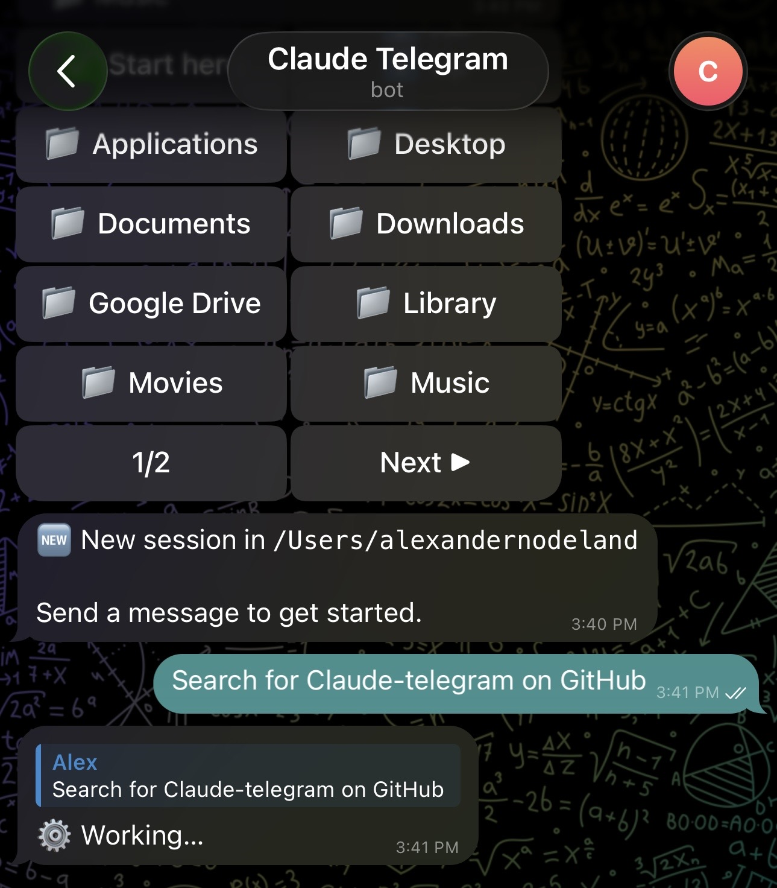
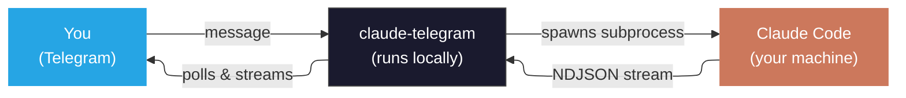
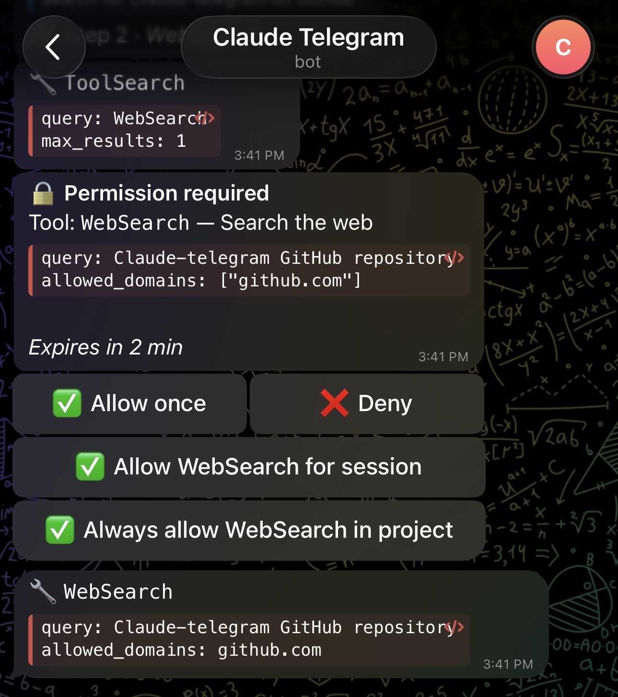
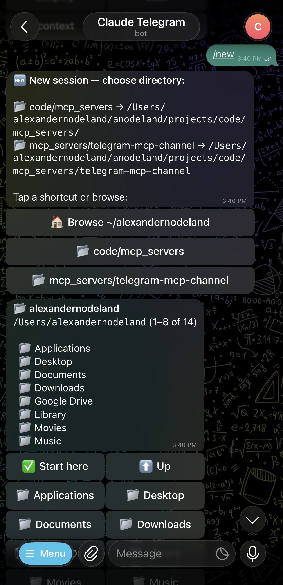
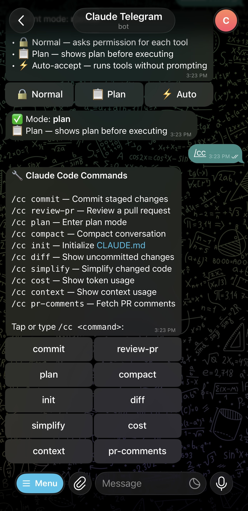
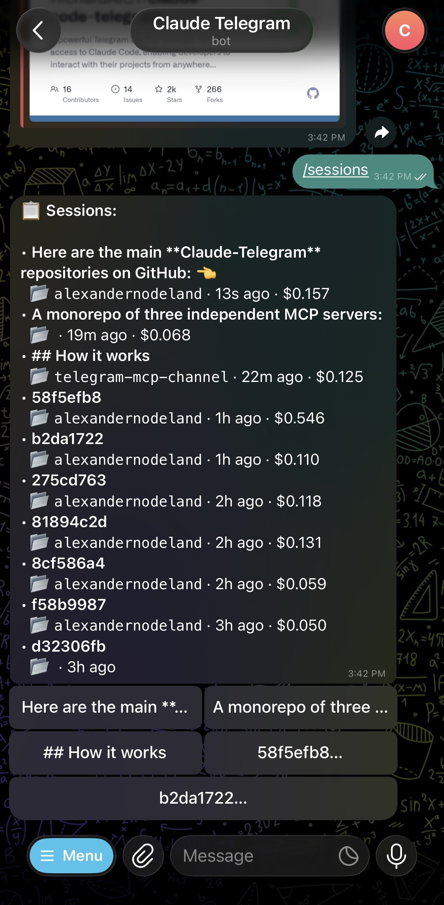

<div align="center">

# claude-telegram

**Control Claude Code from Telegram — run tasks, review diffs, and ship code from your phone.**

[](https://www.npmjs.com/package/@alexnodeland/claude-telegram)
[](https://github.com/alexnodeland/claude-telegram/releases)
[](https://github.com/alexnodeland/claude-telegram/actions/workflows/ci.yml)
[](https://opensource.org/licenses/MIT)
[](https://bun.sh)
[](https://docs.anthropic.com/en/docs/claude-code)
[](https://modelcontextprotocol.io)

<br />



<br />

_Tool calls stream in real time with a live status bar and cost tracking._

</div>

<br />

A local bridge between Telegram and [Claude Code](https://docs.anthropic.com/en/docs/claude-code). Send a message from your phone, Claude reads your codebase, edits files, runs commands, and replies — everything stays on your machine.



## Why

You're away from your desk but need to:

- Fix a broken CI pipeline before standup
- Ask a question about a codebase you don't have open
- Kick off a refactor and watch it happen
- Review and commit code on the go

Claude Telegram gives you full Claude Code access from any Telegram client — phone, tablet, desktop. No SSH, no cloud relay, no exposed ports. It runs on your machine and talks to Telegram's Bot API.

## Quick start

### Prerequisites

- [Bun](https://bun.sh) >= 1.1
- [Claude Code](https://docs.anthropic.com/en/docs/claude-code) >= 2.1
- A Telegram bot token (message [@BotFather](https://t.me/BotFather), send `/newbot`, copy the token)

### Install and run

```bash
# Install the package
bun add -g @alexnodeland/claude-telegram

# Set your bot token
export TELEGRAM_BOT_TOKEN=your_token_here

# Start the orchestrator
claude-telegram-orchestrator
```

Or run directly without installing:

```bash
TELEGRAM_BOT_TOKEN=your_token_here bunx @alexnodeland/claude-telegram/src/orchestrator.ts
```

### Pair your Telegram account

1. Send `/start` to your bot in Telegram
2. An already-approved user sends `/approve <CODE>` with the 6-character pairing code

To pre-approve users on first run, set `TELEGRAM_ALLOWED_USERS` with comma-separated Telegram user IDs:

```bash
TELEGRAM_ALLOWED_USERS=783772449 claude-telegram-orchestrator
```

### Running as a daemon

A built-in script sets up launchd (macOS) or systemd (Linux) automatically:

```bash
claude-telegram-daemon install    # install and start
claude-telegram-daemon status     # check if running
claude-telegram-daemon logs       # tail logs
claude-telegram-daemon uninstall  # stop and remove
```

Auto-restarts on crash and starts on login. See the [orchestrator docs](docs/orchestrator-mode.md#running-as-a-daemon) for manual setup options.

> [!TIP]
> The **orchestrator mode** above is standalone and manages its own Claude sessions. There's also a [channel mode](docs/channel-mode.md) that attaches Telegram to an existing Claude Code session as an MCP plugin.

## Features

### Session management
Start sessions in any project directory with a navigable file browser. Resume previous sessions by title. Run multiple sessions across different projects.

### Real-time streaming
Tool calls, text output, and errors stream as separate messages with a live status bar showing the current step, tool count, and running cost.

### Permission control
Permission prompts are forwarded to Telegram with granular options — approve once, for the session, or always for the project. Switch between normal, plan, and auto-accept modes.

### Slash command pass-through
Run Claude Code commands directly: `/cc commit`, `/cc review-pr 123`, `/cc diff`. Or tap through an interactive menu.

### Job scheduling
Schedule prompts to run on a recurring or one-shot basis. Use natural syntax like `every 30m`, `at 9am weekdays`, or raw cron expressions. Claude can also self-schedule work via MCP tools — e.g. "check the deploy every 5 minutes" creates a job that outlives the session.

## Commands

| Command | What it does |
|---|---|
| `/new` | Start a session — shows a directory browser to pick your project |
| `/resume` | Resume a previous session by title |
| `/sessions` | List all sessions with tap-to-resume buttons |
| `/cc` | Claude Code slash commands — menu or `/cc commit` directly |
| `/mode` | Switch between normal / plan / auto-accept |
| `/model` | Switch between sonnet / opus / haiku |
| `/stop` | Stop current task or end session |
| `/dirs` | Browse bookmarked and recent directories |
| `/bookmark` | Save a directory shortcut: `/bookmark /path --name alias` |
| `/schedule` | Schedule a job: `/schedule "run tests" every 30m` |
| `/jobs` | List scheduled jobs with pause/cancel buttons |
| `/cancel` | Cancel a scheduled job by ID |
| `/pause` | Pause or resume a scheduled job |
| `/cost` | Show session cost |
| `/status` | Full session info |
| `/help` | Show all commands |

Anything that isn't a command is sent as a prompt to Claude.

## Screenshots

<table>
<tr>
<td width="50%">

**Permission prompts** — approve once, for the session, or always for the project.

</td>
<td width="50%">

**Directory browser** — navigate folders, bookmark shortcuts, tap to start.

</td>
</tr>
<tr>
<td>



</td>
<td>



</td>
</tr>
<tr>
<td>

**`/cc` command menu** — run slash commands and switch modes from the chat.

</td>
<td>

**Session list** — auto-generated titles, tap to resume.

</td>
</tr>
<tr>
<td>



</td>
<td>



</td>
</tr>
</table>

## Security

- **Runs locally** — no cloud relay, no data leaves your machine, no inbound ports
- **Pairing codes** — 6-character, 10-minute expiry, one-time use
- **Allowlist** — only paired Telegram users can interact
- **Permission relay** — HTTP server binds to `127.0.0.1` only
- **Zero Telegram SDK** — native `fetch` only, minimal attack surface

## Documentation

| Doc | Contents |
|---|---|
| [Orchestrator Mode](docs/orchestrator-mode.md) | Setup, commands, permissions, streaming, sessions, env vars |
| [Channel Mode](docs/channel-mode.md) | MCP channel plugin setup, pairing, access commands, tools |
| [Architecture](docs/architecture.md) | System design, module map, security model, data flow |
| [Changelog](CHANGELOG.md) | Release history |
| [Contributing](CONTRIBUTING.md) | Development setup, code style, testing, pull requests |

## Contributing

See [CONTRIBUTING.md](CONTRIBUTING.md) for development setup and guidelines.

## License

[MIT](LICENSE)
