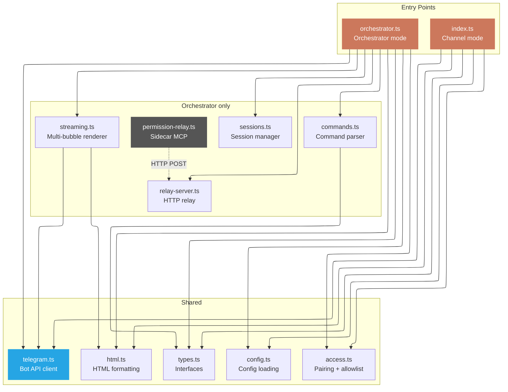
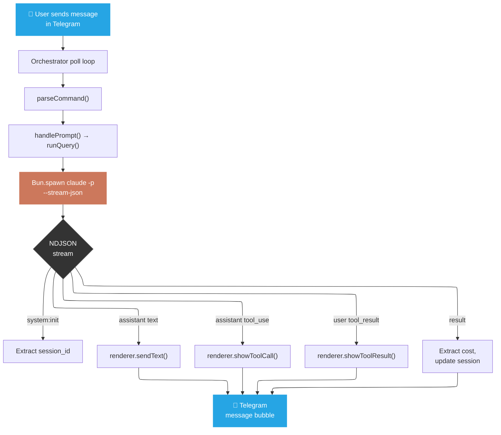
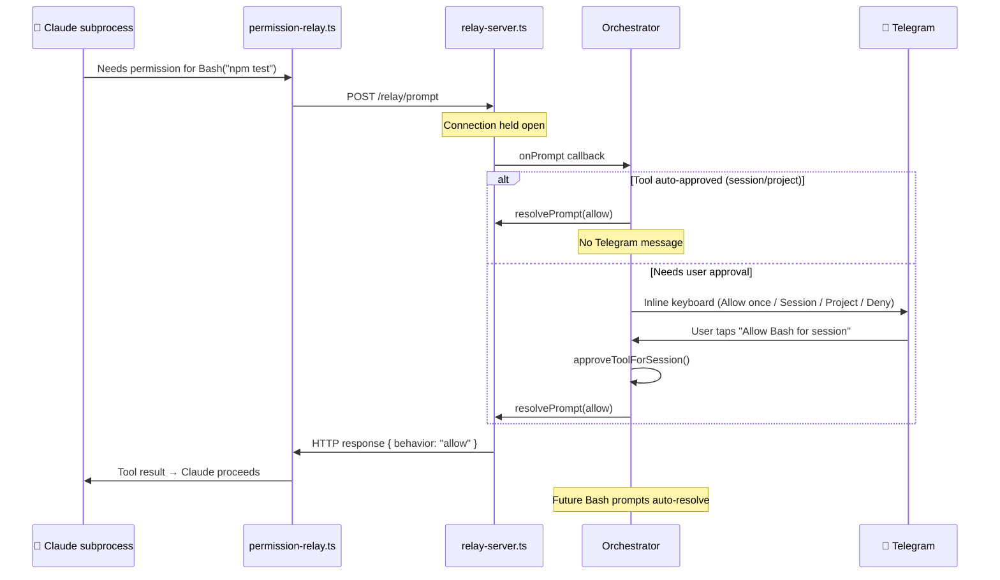

# Architecture

## Overview

```
claude-telegram/
├── src/
│   ├── index.ts              # Channel mode — MCP server with claude/channel capability
│   ├── orchestrator.ts       # Orchestrator mode — standalone process, manages Claude CLI
│   ├── telegram.ts           # Telegram Bot API client (native fetch, zero SDKs)
│   ├── html.ts               # HTML escape + formatting helpers for Telegram
│   ├── commands.ts           # Telegram command parser (pure function)
│   ├── sessions.ts           # Session state + persistence
│   ├── streaming.ts          # Multi-bubble renderer for tool calls + text
│   ├── access.ts             # Pairing codes + allowlist
│   ├── config.ts             # Config loading from env + file
│   ├── types.ts              # All TypeScript interfaces
│   ├── relay-server.ts       # Local HTTP server for permission relay
│   └── permission-relay.ts   # Sidecar MCP server spawned per Claude subprocess
├── tests/                    # 112 tests across 5 files (Bun test runner)
├── docs/                     # Documentation
├── .env.example              # Environment variable template
├── .mcp.json.example         # MCP config template
├── CLAUDE.md                 # Contributor guidelines + design decisions
├── justfile                  # Task runner recipes
└── package.json
```

## Module map



## Modules

### Entry points

**`index.ts` — Channel mode**
- MCP server declaring the `claude/channel` experimental capability
- Registers 9 tools (5 reply/output, 4 access management)
- Long-polls Telegram for messages, pushes channel events to Claude Code via MCP notifications
- Typing indicator keepalive while Claude is processing

**`orchestrator.ts` — Orchestrator mode**
- Standalone Bun process — no MCP server, no Claude Code dependency
- Long-polls Telegram, parses commands, spawns `claude -p --output-format stream-json` subprocesses
- Streams NDJSON output to Telegram via `StreamingRenderer`
- Manages sessions, permissions, directory bookmarks, and the relay server

### Core modules

**`telegram.ts` — Telegram Bot API client**
- Zero external SDKs — all calls via native `fetch`
- Methods: `sendMessage`, `editMessageText`, `sendDocument`, `sendPhoto`, `sendReaction`, `sendMessageWithKeyboard`, `answerCallbackQuery`, `sendChatAction`, `setMyCommands`, `getUpdates`, `getFile`, `downloadFile`, `deleteMessage`
- All text messages use `parse_mode: "HTML"` for robust formatting

**`html.ts` — HTML formatting**
- `escapeHtml(text)` — escapes `&`, `<`, `>` for Telegram HTML
- `fmt` object — `bold()`, `italic()`, `code()`, `pre()`, `preBlock()`, `link()`, `strikethrough()` — each auto-escapes content

**`commands.ts` — Command parser**
- Pure function `parseCommand(text) → Command`
- Returns discriminated union: `new`, `resume`, `sessions`, `stop`, `compact`, `model`, `mode`, `cost`, `status`, `cc`, `cc_menu`, `dirs`, `bookmark`, `help`, `approve`, `unknown_command`, `prompt`
- Distinguishes unknown `/commands` from plain text prompts

**`streaming.ts` — Multi-bubble renderer**
- `StreamingRenderer` class: manages status message + tool call messages + text bubbles
- Step counter in status: "Step 3 · Read · ...src/auth.ts"
- Tool call formatting with icons: 📖 Read, ✏️ Edit, 📝 Write, 💻 Bash, 🔍 Glob, 🔎 Grep, 🤖 Agent
- Tool result previews (300 char inline, full output as `.txt` document for >1000 chars)
- Error/success indication on tool results
- `sendLongMessage()` — splits >4096 char text at line/space boundaries

**`sessions.ts` — Session management**
- `SessionManager` class with `create`, `getActive`, `setActive`, `endActive`, `listForChat`
- Lookup by name, title (fuzzy substring), or ID prefix
- Cost accumulation per session
- Persists to `~/.claude/channels/telegram/sessions.json`

**`access.ts` — Access control**
- Pairing code generation (6-char alphanumeric, confusable chars excluded)
- Time-limited codes (10 min TTL)
- Allowlist persistence at `~/.claude/channels/telegram/allowlist.json`
- Three policies: `pairing`, `allowlist`, `open`

### Permission relay

**`relay-server.ts` — HTTP relay**
- `Bun.serve()` on `127.0.0.1:0` (random available port)
- Holds HTTP connections open until user responds via Telegram callback
- 2-minute timeout → auto-deny
- One pending prompt per chat at a time

**`permission-relay.ts` — Sidecar MCP server**
- Spawned per Claude subprocess via `--mcp-config`
- Registers single tool `prompt_handler`
- POSTs permission requests to the relay HTTP server
- Blocks until user responds, returns `{ behavior, updatedInput }` to Claude

## Data flow

### Orchestrator mode — prompt execution



### Permission relay flow



## Security model

| Layer | Implementation |
|---|---|
| **Network** | No inbound ports. Outbound polling to `api.telegram.org` only. |
| **Telegram access** | Pairing codes (6-char, 10-min TTL) + persistent allowlist. |
| **Permission relay** | HTTP server on `127.0.0.1` only — no network exposure. |
| **Telegram SDK** | None. Native `fetch` reduces dependency surface. |
| **Secrets** | Bot token from env var or `~/.claude/channels/telegram/.env`. Never logged. |
| **Tool safety** | Permission prompts with granular approval (once / session / project). |

## Data storage

| Path | Contents |
|---|---|
| `~/.claude/channels/telegram/.env` | Bot token (optional — can use env var instead) |
| `~/.claude/channels/telegram/allowlist.json` | Access policy + allowlisted user IDs |
| `~/.claude/channels/telegram/sessions.json` | Session history (IDs, titles, costs, directories) |
| `~/.claude/channels/telegram/bookmarks.json` | Directory bookmarks |

## Design decisions

See [CLAUDE.md](../CLAUDE.md) for rationale on:
- HTML parse mode (why not Markdown)
- Navigable directory browser (callback_data 64-byte limit)
- Client-side permission memory (session/project scoped)
- Session title extraction
- `/cc` slash command pass-through
