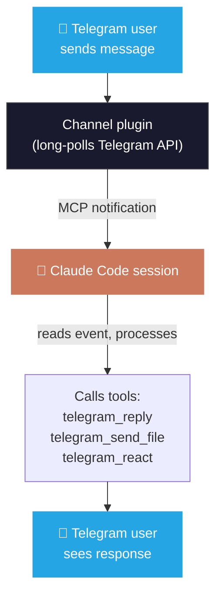

# Channel Mode

Channel mode runs as an MCP channel plugin inside a running Claude Code session. Messages from Telegram appear as live channel events that Claude can read and respond to using the registered tools.

This is different from orchestrator mode — instead of managing its own sessions, it attaches to a session you've already started in your terminal.

## When to use channel mode vs orchestrator mode

| | Channel mode | Orchestrator mode |
|---|---|---|
| **How it runs** | Inside an existing Claude Code session | Standalone process |
| **Who spawns Claude** | You (in your terminal) | The orchestrator (from Telegram) |
| **Session control** | You manage the session locally | Managed from Telegram (`/new`, `/resume`, `/stop`) |
| **Best for** | Adding Telegram I/O to a session you're already in | Fully remote — phone-only control |

## Setup

### 1. Install

```bash
bun add -g @alexnodeland/claude-telegram
```

### 2. Configure MCP

Add to `.mcp.json` in your project root (or `~/.claude.json` for global access):

```json
{
  "mcpServers": {
    "telegram": {
      "command": "bun",
      "args": ["run", "PACKAGE_PATH/src/index.ts"],
      "env": {
        "TELEGRAM_BOT_TOKEN": "your_token_here"
      }
    }
  }
}
```

Replace `PACKAGE_PATH` with the installed package location (run `bun pm ls -g` to find it, typically `~/.bun/install/global/node_modules/@alexnodeland/claude-telegram`).

See [`.mcp.json.example`](../.mcp.json.example) for a template.

### 2. Start Claude Code with the channel flag

```bash
claude --dangerously-load-development-channels server:telegram
```

The `--dangerously-load-development-channels` flag is required because channels are an experimental Claude Code feature.

### 3. Pair your Telegram account

1. Send `/start` to your bot in Telegram
2. The bot replies with a 6-character pairing code
3. In Claude Code, run: `/telegram:access pair <CODE>`
4. Lock down access: `/telegram:access policy allowlist`

## Access commands

Run these inside Claude Code (not in Telegram):

| Command | Description |
|---|---|
| `/telegram:access pair <CODE>` | Approve a pairing request |
| `/telegram:access policy pairing` | Allow new pairings (default) |
| `/telegram:access policy allowlist` | Locked — only already-paired users |
| `/telegram:access policy open` | Anyone can message (testing only) |
| `/telegram:access remove <USER_ID>` | Revoke a user's access |
| `/telegram:access status` | Show bot info, current policy, allowlist, pending codes |

### Access policies

| Policy | Behavior |
|---|---|
| `pairing` | New users can request access via `/start` — someone must `/approve` them (default) |
| `allowlist` | Only already-paired users can interact — no new pairings accepted |
| `open` | Anyone can message the bot — **testing only** |

## MCP tools

These are the tools Claude uses internally to communicate through Telegram. You don't call them directly — Claude decides when to use them based on the channel events it receives.

| Tool | Description |
|---|---|
| `telegram_reply` | Send a text reply (HTML formatting, max 4096 chars) |
| `telegram_react` | Add an emoji reaction to a message |
| `telegram_edit_message` | Edit a message the bot previously sent |
| `telegram_send_file` | Upload a local file or image (max 50 MB) |
| `telegram_send_typing` | Show typing indicator (auto-expires after 5s) |
| `telegram_access_pair` | Approve a pairing code |
| `telegram_access_policy` | Change access policy |
| `telegram_access_remove` | Revoke a user |
| `telegram_access_status` | Show access status |

## How it works



The channel plugin maintains a typing indicator keepalive — while Claude is working, the user sees "typing..." in Telegram.

## Limitations

- The Claude Code session must stay open for the bridge to work. Use `tmux` or `screen` for persistence.
- Only one process can poll a bot token at a time. Don't run channel mode and orchestrator mode on the same bot simultaneously (create a second bot if needed).
- Channel mode doesn't have session management (`/new`, `/resume`, etc.) — that's orchestrator-only.

## Troubleshooting

**Bot doesn't respond to `/start`**
Make sure Claude Code is running with the channel flag. Check terminal for the startup message.

**`TELEGRAM_BOT_TOKEN not set`**
Set it in the MCP config's `env` block or export it in your shell.

**409 Conflict: terminated by other getUpdates request**
Another process is polling the same bot. Stop it, or create a second bot via @BotFather.

**Messages stop after a while**
The Claude Code session ended. Keep it open with `tmux`.

**Team / Enterprise: channels flag ignored**
An admin must enable channels at `claude.ai → Admin settings → Claude Code → Channels`.
