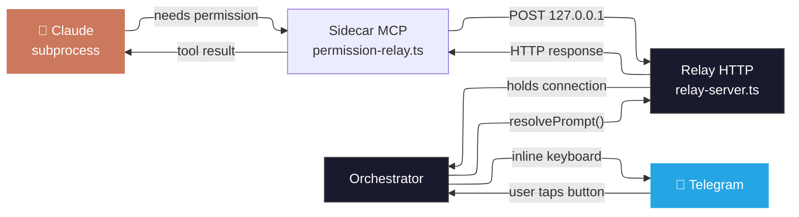

# Orchestrator Mode

The orchestrator runs as a standalone process that manages Claude Code sessions from Telegram. It spawns `claude` CLI subprocesses, streams their output to Telegram in real time, and relays permission prompts for user approval.

## Setup

### Install

```bash
bun add -g @alexnodeland/claude-telegram
```

### Running

```bash
# Set your bot token
export TELEGRAM_BOT_TOKEN=your_token_here

# Start the orchestrator
claude-telegram-orchestrator
```

For development (from a local clone):

```bash
bun run start:orchestrator        # Production
just dev-orchestrator             # Watch mode
```

### First-time pairing

1. Start the orchestrator
2. Send `/start` to your bot in Telegram
3. The bot replies with a 6-character pairing code
4. An already-approved user sends `/approve <CODE>` to pair you

To pre-approve users without pairing:

```bash
TELEGRAM_ALLOWED_USERS=783772449,123456 bun run start:orchestrator
```

### Running as a daemon

**macOS (launchd):**

Create `~/Library/LaunchAgents/com.claude-telegram.plist`:

```xml
<?xml version="1.0" encoding="UTF-8"?>
<!DOCTYPE plist PUBLIC "-//Apple//DTD PLIST 1.0//EN" "http://www.apple.com/DTDs/PropertyList-1.0.dtd">
<plist version="1.0">
<dict>
    <key>Label</key>
    <string>com.claude-telegram</string>
    <key>ProgramArguments</key>
    <array>
        <string>/Users/YOU/.bun/bin/bun</string>
        <string>run</string>
        <string>/Users/YOU/.bun/install/global/node_modules/@alexnodeland/claude-telegram/src/orchestrator.ts</string>
    </array>
    <key>EnvironmentVariables</key>
    <dict>
        <key>TELEGRAM_BOT_TOKEN</key>
        <string>your_token_here</string>
        <key>PATH</key>
        <string>/usr/local/bin:/usr/bin:/bin:/Users/YOU/.bun/bin</string>
    </dict>
    <key>KeepAlive</key>
    <true/>
    <key>StandardOutPath</key>
    <string>/tmp/claude-telegram.log</string>
    <key>StandardErrorPath</key>
    <string>/tmp/claude-telegram.log</string>
</dict>
</plist>
```

```bash
launchctl load ~/Library/LaunchAgents/com.claude-telegram.plist    # start
launchctl unload ~/Library/LaunchAgents/com.claude-telegram.plist  # stop
```

**Linux (systemd):**

Create `~/.config/systemd/user/claude-telegram.service`:

```ini
[Unit]
Description=Claude Telegram Orchestrator
After=network.target

[Service]
ExecStart=%h/.bun/bin/bun run %h/.bun/install/global/node_modules/@alexnodeland/claude-telegram/src/orchestrator.ts
Environment=TELEGRAM_BOT_TOKEN=your_token_here
Restart=on-failure
RestartSec=5

[Install]
WantedBy=default.target
```

```bash
systemctl --user daemon-reload
systemctl --user enable --now claude-telegram   # start + enable on boot
systemctl --user status claude-telegram         # check status
journalctl --user -u claude-telegram -f         # view logs
```

**tmux (any platform):**

```bash
tmux new-session -d -s claude 'claude-telegram-orchestrator'
tmux attach -t claude   # re-attach any time
```

## Commands

All commands register in Telegram's bot menu for autocomplete.

### Session management

| Command | Description |
|---|---|
| `/new [path] [--name n]` | Start a new session. Shows a navigable directory browser if no path given. |
| `/resume [name\|id\|title]` | Resume a previous session. Shows interactive picker with session titles. |
| `/sessions` | List all sessions with tap-to-resume inline buttons. |
| `/stop` | Stop the current task and end the session. |
| `/compact` | Start a fresh session in the same directory. Previous session is preserved for `/resume`. |

### Claude Code integration

| Command | Description |
|---|---|
| `/cc [command]` | Run a Claude Code slash command. `/cc` alone shows a menu of popular commands. Examples: `/cc commit`, `/cc review-pr 123`, `/cc diff` |
| `/mode [normal\|plan\|auto]` | Switch permission mode. Shows a picker if no mode given. |
| `/model [name]` | View or change the model. Shows picker with sonnet/opus/haiku. |
| `/cost` | Show accumulated session cost and turns. |
| `/status` | Full session info — directory, model, mode, cost, state. |
| `/help` | Show all commands. Includes current session context at the top. |

### Directory management

| Command | Description |
|---|---|
| `/dirs` | Browse bookmarked and recent directories. |
| `/bookmark /path [--name alias]` | Save a directory shortcut. |

The directory browser supports:
- **Pagination** — Next/Prev buttons for directories with many subdirectories
- **Navigation** — drill into folders, go up, confirm with "Start here"
- **Shortcuts** — bookmarks and recent session directories shown at the top

### Admin

| Command | Description |
|---|---|
| `/approve <CODE>` | Approve a pairing code from a new user. |

### Plain text

Any text that isn't a command is sent as a prompt to the active Claude session.

## Permission prompts

When Claude needs permission to run a tool, the prompt is relayed to Telegram with three tiers:

| Button | Behavior |
|---|---|
| **Allow once** | Approve this single invocation |
| **Allow `<tool>` for session** | Auto-approve all future uses of this tool type until `/stop` |
| **Always allow `<tool>` in project** | Auto-approve in any session using the same working directory |

Auto-approved tools resolve instantly without showing a message.

If no response is given within 2 minutes, the action is auto-denied.

### How the relay works



## Real-time streaming

Instead of waiting for Claude to finish, output streams as it happens:

- **Text responses** — each block is a separate Telegram message
- **Tool calls** — formatted with icons and code blocks:
  - `📖 Read` / `✏️ Edit` / `📝 Write` — file path
  - `💻 Bash` — command + output preview
  - `🔍 Glob` / `🔎 Grep` — search pattern
  - `🤖 Agent` — sub-agent description
- **Status message** — updates in place with step counter: "Step 3 · Read · ...src/auth.ts"
- **Tool results** — previewed inline (300 chars), full output sent as `.txt` document for large results
- **Error indication** — failed tool results shown with error icon
- **Cost** — final status shows total cost and turns

## Session management

Sessions are persisted to `~/.claude/channels/telegram/sessions.json`.

- **Auto-generated titles** — derived from Claude's first response, shown in `/sessions` and `/resume` instead of opaque UUIDs
- **Named sessions** — use `/new /path --name myproject` for custom names
- **Resume by title** — `/resume auth refactor` matches session titles by substring
- **Multi-project** — switch between projects with `/sessions` + tap-to-resume

## Environment variables

| Variable | Default | Description |
|---|---|---|
| `TELEGRAM_BOT_TOKEN` | *(required)* | Telegram bot token from @BotFather |
| `ORCHESTRATOR_DEFAULT_CWD` | `$HOME` | Default directory for `/new` without a path |
| `ORCHESTRATOR_MAX_TURNS` | `50` | Max agentic turns per prompt |
| `ORCHESTRATOR_MODEL` | *(system default)* | Default Claude model |
| `TELEGRAM_ALLOWED_USERS` | *(none)* | Comma-separated Telegram user IDs to pre-approve |

See [`.env.example`](../.env.example) for a template.
